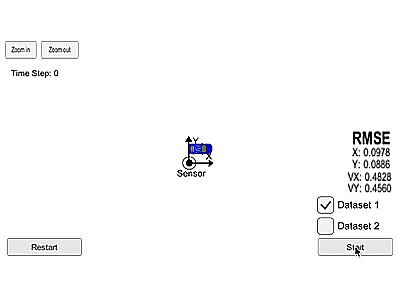

[image1]: ./images/eqn.png 
[image2]: ./images/process.png
[image3]: ./images/sensor_comp.png
[gif1]:   ./video/EKF.gif
# Extended Kalman Filter Project.

Self-Driving Car Engineer ND Program

## Overview 
In this project we utilize Kalman Filter (KF) and Extended Kalman Filter (EKF) to estimate the state of a moving object of interest with noisy LIDAR and RADAR measurements.

### Sensor Comparison
![alt text][image3]
**LIDAR** (LIght Detection And Ranging):  
linear measurement function -> KF 
 
**RADAR** (RAdio Detection And Ranging):  
 nonlinear measurement function -> EKF 

### Sensor Fusion Process
![alt text][image2]

### Kalman Filter Scheme
![alt text][image1]
**H** is the matrix that projects current state into the measurement space. For
RADAR, **H** is nonlinear, we need to linearize it by Jacobian, which is EKF.

If we were in an autonomous vehicle tracking a bicycle, pedestrian or another car, we would not be able to model the internal forces of the other object; hence, we do not know for certain what the other object's acceleration is. Instead, we will ignore the control input and represent acceleration as a random noise.

### Setting Up
This project uses the Term 2 Simulator which can be downloaded [here.](https://github.com/udacity/self-driving-car-sim/releases)

This repository includes two files that can be used to set up and install [uWebSocketIO](https://github.com/uWebSockets/uWebSockets) for either Linux or Mac systems. For windows you can use either Docker, VMware, or even [Windows 10 Bash on Ubuntu](https://www.howtogeek.com/249966/how-to-install-and-use-the-linux-bash-shell-on-windows-10/) to install uWebSocketIO. Please see [this concept in the classroom](https://classroom.udacity.com/nanodegrees/nd013/parts/40f38239-66b6-46ec-ae68-03afd8a601c8/modules/0949fca6-b379-42af-a919-ee50aa304e6a/lessons/f758c44c-5e40-4e01-93b5-1a82aa4e044f/concepts/16cf4a78-4fc7-49e1-8621-3450ca938b77) for the required version and installation scripts.

Once the install for uWebSocketIO is complete, the main program can be built and run by doing the following from the project top directory.

1. mkdir build
2. cd build
3. cmake ..
4. make
5. ./ExtendedKF

INPUT: values provided by the simulator to the c++ program

["sensor_measurement"] => the measurement that the simulator observed (either lidar or radar)

OUTPUT: values provided by the c++ program to the simulator

["estimate_x"] <= kalman filter estimated position x
["estimate_y"] <= kalman filter estimated position y
["rmse_x"]
["rmse_y"]
["rmse_vx"]
["rmse_vy"]

---

## Other Important Dependencies

Refer [Udacity link's](https://github.com/udacity/CarND-Extended-Kalman-Filter-Project) **Other Important Dependencies** section.

## Basic Build Instructions

After having the dependencies above met :

1. Clone this repo.
2. Make a build directory: `mkdir build && cd build`
3. Compile: `cmake .. && make`
   * On windows, you may need to run: `cmake .. -G "Unix Makefiles" && make`
4. Run it: `./ExtendedKF `

## Project Implementation details.

- **src/main.cpp :** Read the sensor data line by line from the client and stores the data into a measurement object that it passes to the Kalman filter for processing. Also a ground truth list and an estimation list are used for tracking RMSE.  
- **src/FusionEKF.cpp :** 
  1. initialized variables and matrices 
  2. update the F and Q matrices based on the elapsed time between measurements
  3. update step for  lidar or radar sensor measuremen
- **kalman_filter.cpp :** implement the **prediction** and **update** equations.
- **tools.cpp :** implemented functions to calculate **root mean squared error** and the **Jacobian matrix**.

